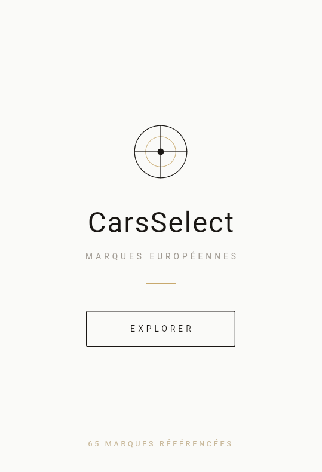
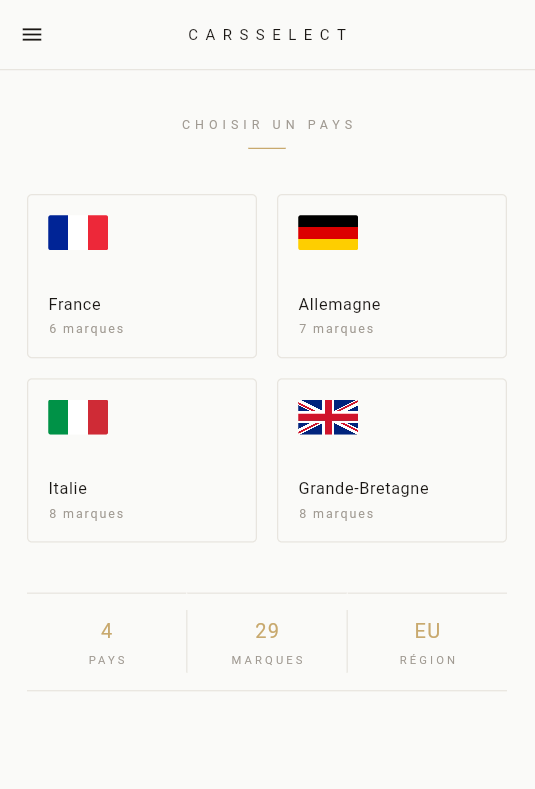
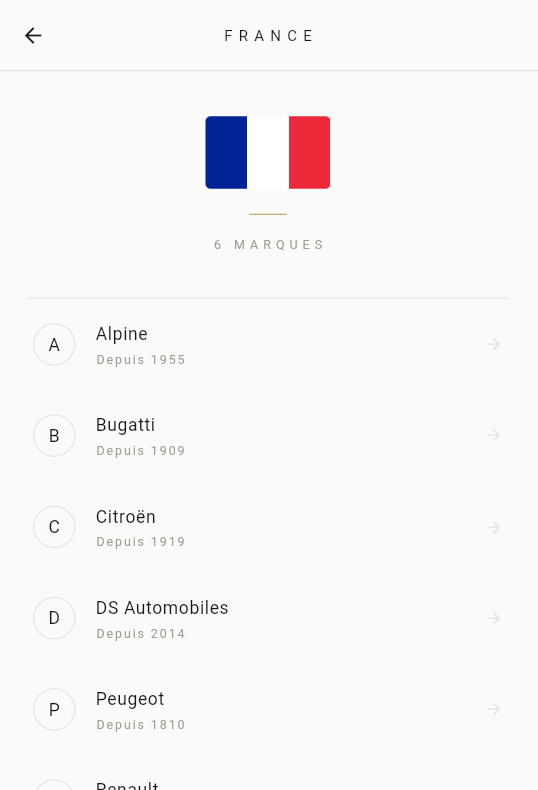
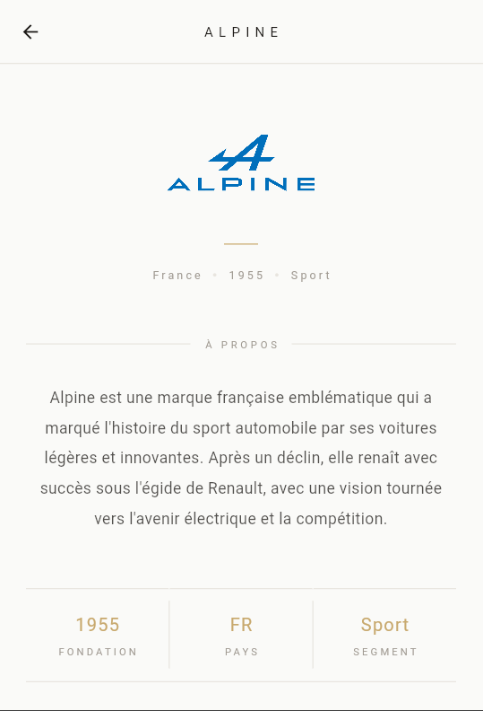

# 🚗 CarsSelect

Une application mobile **Flutter** qui référence les marques automobiles européennes, organisées par pays.

---

## 📱 Aperçu

<!-- Ajoutez vos captures d'écran ici -->
<!-- Conseil : placez vos images dans un dossier /screenshots à la racine du projet -->

| Splash Screen | Accueil | Page Pays | Page Marque |
|:---:|:---:|:---:|:---:|
|  |  |  |  |

> 💡 **Pour ajouter vos screenshots :**
> 1. Créez un dossier `screenshots/` à la racine du projet
> 2. Faites des captures depuis votre émulateur ou appareil
> 3. Nommez-les `splash.png`, `accueil.png`, `pays.png`, `marque.png`
> 4. Remplacez les chemins dans le tableau ci-dessus

---

## ✨ Fonctionnalités

- 🌍 **4 pays** couverts : France, Allemagne, Italie, Grande-Bretagne
- 🏎️ **29 marques** automobiles référencées
- 📖 **Fiche détaillée** par marque (description, année de fondation, segment)
- 🎨 **Design minimaliste** — palette blanc cassé, accents dorés
- 🔄 **Navigation fluide** entre les pages avec animations
- 📋 **Menu drawer** pour accéder rapidement aux pays

---

## 🗂️ Structure du projet

```
lib/
├── main.dart               # Point d'entrée de l'app
├── myapp.dart              # Configuration des routes
├── splash_screen.dart      # Écran de démarrage animé
├── accueil.dart            # Page d'accueil (sélection du pays)
├── france.dart             # Liste des marques françaises
├── allemagne.dart          # Liste des marques allemandes
├── italie.dart             # Liste des marques italiennes
├── angleterre.dart         # Liste des marques britanniques
├── fr/                     # Pages des marques françaises
│   ├── alpine.dart
│   ├── bugatti.dart
│   ├── citroen.dart
│   ├── ds.dart
│   ├── peugeot.dart
│   └── renault.dart
├── de/                     # Pages des marques allemandes
│   ├── audi.dart
│   ├── bmw.dart
│   ├── mercedes.dart
│   ├── opel.dart
│   ├── porsche.dart
│   ├── smart.dart
│   └── volkswagen.dart
├── it/                     # Pages des marques italiennes
│   ├── abarth.dart
│   ├── alfa.dart
│   ├── ferrari.dart
│   ├── fiat.dart
│   ├── lamborghini.dart
│   ├── lancia.dart
│   ├── maserati.dart
│   └── pagani.dart
└── uk/                     # Pages des marques britanniques
    ├── aston.dart
    ├── bentley.dart
    ├── jaguar.dart
    ├── land.dart
    ├── lotus.dart
    ├── mclaren.dart
    ├── mini.dart
    └── rolls.dart

assets/
└── images/
    ├── france.png
    ├── allemagne.png
    ├── italie.png
    ├── uk.png
    ├── fr/         # Logos marques françaises
    ├── de/         # Logos marques allemandes
    ├── it/         # Logos marques italiennes
    └── uk/         # Logos marques britanniques
```

---

## 🌍 Marques référencées

<details>
<summary><strong>🇫🇷 France — 6 marques</strong></summary>

| Marque | Fondée | Segment |
|--------|--------|---------|
| Alpine | 1955 | Sport |
| Bugatti | 1909 | Hypercar |
| Citroën | 1919 | Généraliste |
| DS Automobiles | 2014 | Premium |
| Peugeot | 1810 | Généraliste |
| Renault | 1899 | Généraliste |

</details>

<details>
<summary><strong>🇩🇪 Allemagne — 7 marques</strong></summary>

| Marque | Fondée | Segment |
|--------|--------|---------|
| Audi | 1909 | Premium |
| BMW | 1916 | Premium |
| Mercedes-Benz | 1926 | Luxe |
| Opel | 1862 | Généraliste |
| Porsche | 1931 | Sport |
| Smart | 1994 | Urbain |
| Volkswagen | 1937 | Généraliste |

</details>

<details>
<summary><strong>🇮🇹 Italie — 8 marques</strong></summary>

| Marque | Fondée | Segment |
|--------|--------|---------|
| Abarth | 1949 | Sport |
| Alfa Romeo | 1910 | Premium |
| Ferrari | 1939 | Supercar |
| Fiat | 1899 | Généraliste |
| Lamborghini | 1963 | Supercar |
| Lancia | 1906 | Premium |
| Maserati | 1914 | Luxe |
| Pagani | 1992 | Hypercar |

</details>

<details>
<summary><strong>🇬🇧 Grande-Bretagne — 8 marques</strong></summary>

| Marque | Fondée | Segment |
|--------|--------|---------|
| Aston Martin | 1913 | Luxe |
| Bentley | 1919 | Luxe |
| Jaguar | 1922 | Premium |
| Land Rover | 1948 | SUV |
| Lotus | 1948 | Sport |
| McLaren | 1963 | Supercar |
| MINI | 1959 | Urbain |
| Rolls-Royce | 1906 | Ultra-luxe |

</details>

---

## 🚀 Installation

### Prérequis

- [Flutter SDK](https://docs.flutter.dev/get-started/install) (version 3.0+)
- [Dart SDK](https://dart.dev/get-dart) (inclus avec Flutter)
- Android Studio ou VS Code avec l'extension Flutter
- Un émulateur Android/iOS ou un appareil physique

### Cloner le projet

```bash
git clone https://github.com/Tintin200/CarsSelect.git
cd CarsSelect
```

### Installer les dépendances

```bash
flutter pub get
```

### Lancer l'application

```bash
# Sur émulateur ou appareil connecté
flutter run

# Sur le web
flutter run -d chrome

# Build APK Android
flutter build apk
```

---

## 🧭 Navigation

L'application suit une navigation hiérarchique à 3 niveaux :

```
SplashScreen
    └── Accueil (sélection du pays)
            ├── France
            │     ├── Alpine
            │     ├── Bugatti
            │     └── ...
            ├── Allemagne
            │     └── ...
            ├── Italie
            │     └── ...
            └── Angleterre
                  └── ...
```

Les routes sont déclarées dans `myapp.dart` et utilisent `Navigator.pushNamed()`.

---

## 🎨 Design

L'application utilise un design **minimaliste & clean** :

| Élément | Valeur |
|---------|--------|
| Fond principal | `#FAFAF8` (blanc cassé) |
| Couleur texte | `#1A1714` (noir profond) |
| Accent | `#C8A96E` (doré) |
| Texte secondaire | `#A09A92` (gris chaud) |
| Séparateurs | `#E8E5DF` (gris clair) |

---

## 📦 Dépendances

```yaml
dependencies:
  flutter:
    sdk: flutter
```

> Aucune dépendance externe — l'app utilise uniquement les widgets Flutter natifs.

---

## 🔮 Améliorations futures

- [ ] Ajout de nouveaux pays (Espagne, Suède, Pays-Bas…)
- [ ] Moteur de recherche par marque
- [ ] Système de favoris
- [ ] Mode sombre
- [ ] Galerie photos pour chaque marque
- [ ] Informations sur les modèles phares

---

## 👤 Auteur

**Tintin200**
- GitHub : [@Tintin200](https://github.com/Tintin200)

---

## 📄 Licence

Ce projet est open source. Voir le fichier [LICENSE](LICENSE) pour plus de détails.

---

*© 2025 CarsSelect — Marques automobiles européennes*
